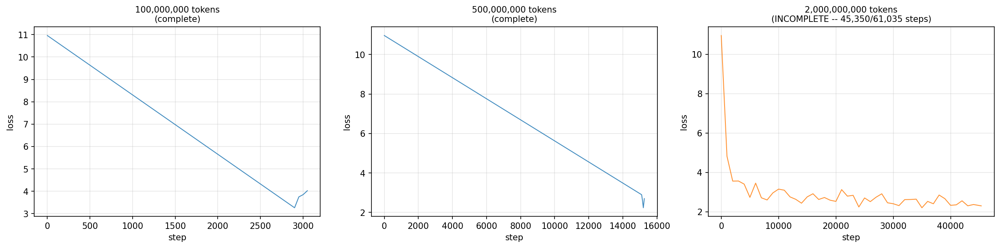

# Ikhaka-MoE — A Domain-Routed Mixture-of-Experts Language Model

A decoder-only transformer with a **DEMix-style hard-routed MoE** feed-forward layer (Gururangan et al., 2021): a document's domain label selects its expert directly, rather than a learned per-token router choosing one. Attention and embeddings are shared and trained jointly across all domains; only the FFN branches. Written up as a design document before any training code, so every parameter count, FLOP estimate, and cost figure below is derived from one configuration block and re-checkable by hand.

**Repo:** `ikhaka-ai/ikhaka.MoE-o1`

---

## Project Structure

```
├── config.py            # MoEConfig, BASE_CONFIG, DEBUG_CONFIG — reads by everything, imports nothing
├── model/
│   ├── layers.py          # Shared trunk: RMSNorm, precompute_rope / apply_rope, GQAAttention
│   ├── moe.py              # Branched half: SwiGLU expert, DemixMoE hard-routing forward pass
│   └── transformer.py      # Block + MoETransformer — the only file that imports both layers.py and moe.py
├── train/
│   └── smoke_test.py       # Phase 0: shape / routing / gradient / param-count checks
└── docs/
    └── moe_design_document.pdf   # Full design document (architecture, data, compute, constraints)
```

`config.py` only describes shapes; `layers.py` and `moe.py` never import each other, so the shared trunk and the branched experts stay independently testable. `transformer.py` is the one place that assembles them.

---

## Architecture

| Hyper-parameter | Value | Note |
|---|---|---|
| Vocabulary | 49,152 | reused tokenizer, not trained from scratch |
| d_model | 768 | hidden width |
| Layers | 12 | depth |
| Attention heads | 12 query / 4 KV | GQA, head_dim 64 |
| FFN width | 2048 | SwiGLU (gate, up, down) |
| Sequence length | 1024 | raise later if needed |
| Experts | 4 | code, mathematics, physics, general |
| Active experts | 1 | hard top-1 by domain label |
| RoPE theta | 10,000 | standard value, not retuned |
| RMSNorm eps | 1e-5 | prevents divide-by-zero only |
| Dropout | 0 | dataset seen once at this token budget, nothing to regularise |
| init_std | 0.02 | GPT-2/LLaMA-class default |

**Parameter count:** 113.2M active (per token), 283.1M total in memory. The embedding table (49,152 × 768 = 37.7M, tied in/out) and the attention stack are shared and not multiplied by expert count, which is why the MoE total is ~2.5x the active figure rather than 4x — only the FFN column grows with expert count.

**Why hard routing instead of a learned router:**
- Experts stay interpretable — nameable, ablatable, removable — versus Mixtral's own finding that learned routing tracks syntax more than domain.
- Tokens-per-expert is fixed at batch construction: no capacity factors, no dropped tokens, no dependence on CUDA-only dropless kernels — keeps a TPU backend viable.
- No router to collapse (the most common small-scale MoE failure mode).
- Experts can be added or removed post-training without retraining the trunk.

**Trade-off, stated plainly:** hard routing can't discover structure the domain labels don't encode, and needs a domain classifier at inference time for unlabelled input — a learned router would find token-level structure this design can't.

---

## Data

Four single-domain corpora, chosen because provenance is the routing signal — shards must not mix domains, since that breaks the static-shape property hard routing depends on.

| Expert | Primary source | Available | Take |
|---|---|---|---|
| Code | The Stack v2 / StarCoder2 | hundreds of B | 5B |
| Mathematics | FineMath, OpenWebMath | ~34B / ~15B | 5B |
| Physics | arXiv physics subset, peS2o | ~5–10B | 5B |
| General | FineWeb-Edu | ~1.3T | 5B |

Physics is the binding constraint — the only row where available supply is close to the target take; if a physics shard comes up short, the plan is to widen it to "scientific text" rather than pad with synthetic data. "Logic" was considered and dropped as a fifth expert: no pretraining corpus of meaningful size exists for it, and deductive competence is treated as emergent from scale rather than isolable as a data slice.

20B tokens as uint16 is ~40GB — stored as immutable shards on R2 (~$0.60/month, zero egress) after a one-time CPU-bound tokenization pass.

---

## Token Budget & Compute

| Budget | Tokens | Ratio to active params | Compute (FLOPs) |
|---|---|---|---|
| Chinchilla-optimal | 2.3B | 20x | 1.54e18 |
| **Recommended** | **20B** | **177x** | **1.36e19** |
| SmolLM-tier | 100B | 883x | 6.79e19 |

20B tokens is the target run: past the knee of the loss curve, completable inside a weekend on rented hardware, and cheap enough that a failed run is an annoyance rather than a disaster. 100B is a candidate second run once the pipeline is proven.

| Hardware | Effective throughput (rel.) | 20B tokens | Cost |
|---|---|---|---|
| T4 (Colab free) | 16 | 9.7 days | $46 |
| L4 (Colab Pro) | 34 | 4.6 days | $53 |
| TPU v5e (Colab Pro) | 59 | 2.7 days | $38 |
| A100 80GB (Colab) | 119 | 31.8 h | $48 |
| **A100 80GB (spot)** | **119** | **31.8 h** | **$26** |
| H100 SXM (spot) | 277 | 13.6 h | $20 |

Spot A100 is the sensible default; spot H100 is cheapest overall despite a lower MFU (a 113M-active, d_model-768 model produces matmuls too small to saturate a large GPU, so bigger chips see worse utilisation) because raw throughput more than compensates.

---

## Memory — the real constraint

AdamW in mixed precision costs ~16 bytes/parameter (bf16 weights, fp32 master copy, bf16 grads, two fp32 moment estimates). For MoE this applies to the **total** parameter count, not the active one, since every expert's optimiser state must stay resident even though only one expert runs per token:

```
optimiser_state = 16 bytes × 283e6 params ≈ 4.53 GB
```
— before a single activation is allocated. This is the trade MoE makes: it buys capacity with memory rather than compute, which rules out memory-constrained hardware (e.g. an 8GB unified-memory laptop) independently of raw throughput.

---

## Constraints & Failure Modes

| Risk | Mitigation |
|---|---|
| fp16 overflow (no bf16 on T4) | use bf16-capable hardware for the real run |
| Spot preemption | checkpoint to R2 every ~25 min; commit via a manifest written last |
| Colab session cap (12h / 24h Pro+) | same checkpoint machinery, or avoid Colab for the real run |
| Expert starvation (one domain's shards exhaust first) | balance shard counts, or repeat the short domain and log the epoch |
| Poor MFU (small matmuls under-occupy large GPUs) | increase batch size before increasing GPU size |
| Silent resume bug | store (epoch, shard, offset); make shard order a function of (seed, epoch) |
| Tokenisation redo | tokenise once, write immutable shards, treat as read-only |

---

## Evaluation

1. **Held-out loss per domain** — the primary signal, four numbers (one per expert) on unseen shards, compared against a FLOP-matched dense baseline of the same active size.
2. **Routing analysis** — because routing is supervised, an expert can be ablated and its per-domain loss impact measured directly (an expert whose removal doesn't hurt its domain hasn't specialised).
3. **Downstream benchmarks** — HellaSwag, ARC-easy, a small MMLU subset, HumanEval for the code expert. Expected weak in absolute terms at this scale; the signal is the delta against the dense baseline, not leaderboard position.

---

## Sequencing

| Phase | What | Where | Cost |
|---|---|---|---|
| 0 | Tiny config (2 layers, d=128, 500 steps, 10MB text) — verify routing fires, checkpoints round-trip, loader resumes | MacBook / free T4 | $0 |
| 1 | Tokenise all four corpora once; immutable shards to R2 | CPU instance | ~$5 |
| 2 | Scaling ladder: 100M / 500M / 2B token runs — fit the loss curve, sanity-check the 20B projection | spot A100 | ~$5 |
| 3 | Full run — 20B tokens, preemption-resilient checkpointing | spot A100 or H100 | $20–26 |
| 4 | Ablations — remove each expert, measure per-domain loss delta; dense FLOP-matched baseline | spot A100 | ~$30 |

Total, including a failed run and ablations: roughly **$80–120**. Phase 0 is not a formality — it's where mistakes that would otherwise cost real money get caught for free.

---

## Scaling Ladder Results

Phase 2 in progress: the 100M and 500M-token rungs are complete; the 2B-token rung is partway through (~23% at last checkpoint). Both completed rungs pass the two sanity checks the ladder is built around — no rung regressed against its own starting loss, and loss improved meaningfully from the smaller rung to the larger one (3.72 → 2.62).



The 2B-token rung (right) is shown in orange to mark it as still in progress — its curve is real but hasn't finished annealing, so its endpoint isn't a final result yet.

.png)

With only the two completed rungs, the power-law fit is exactly determined by two points rather than a statistically robust regression, and the projection to 20B tokens is a 40x extrapolation beyond the largest completed data point — a rough estimate, not a confident prediction. Finishing the 2B-token rung will bring a third point onto the curve and cut that extrapolation down to 10x.

---

## Key References

- Gururangan et al., 2021 — [DEMix Layers](https://arxiv.org/abs/2108.05036) (the architecture this project implements)
- Sukhbaatar et al., 2024 — [Branch-Train-MiX](https://arxiv.org/abs/2403.07816)
- Fedus, Zoph & Shazeer, 2022 — [Switch Transformers](https://arxiv.org/abs/2101.03961)
- Muennighoff et al., 2024 — [OLMoE](https://arxiv.org/abs/2409.02060) (data/code/checkpoints released — closest model to imitate)
- Hoffmann et al., 2022 — [Training Compute-Optimal LLMs](https://arxiv.org/abs/2203.15556) (Chinchilla)
- Karpathy — [nanoGPT](https://github.com/karpathy/nanoGPT) (reference implementation)

Full annotated reading list, including MoE foundations (ST-MoE, GShard, DeepSeekMoE, Mixtral) and systems references (MegaBlocks, scaling laws), is in the design document under `docs/`.

---

## Potential Applications

Not covered in the design document — these are downstream use cases the domain-expert structure lends itself to, worth considering once training and evaluation are further along:

- **Code completion / coding agent** — the code expert is trained on a dedicated 5B-token slice of The Stack v2 / StarCoder2; routed in isolation, it's the natural starting point for an IDE-style completion or agentic coding assistant, sized for on-device or low-latency serving rather than competing with frontier code models.
- **Math and physics tutoring / problem-solving assistant** — the math and physics experts pair naturally with Ikhaka Learn's UNISA/Grade 12 tutoring content (STEM modules, problem sets), potentially as a lightweight, domain-scoped assistant for those subjects specifically.
- **Domain-scoped API endpoints** — because routing is hard and supervised rather than learned, each expert can be deployed or billed independently (e.g. a "code" endpoint vs. a "general" endpoint) without serving the full 283M-parameter model when only one domain is needed.
- **Ablation-driven specialisation research** — the ability to remove an expert and directly measure the per-domain loss impact (Section 10 of the design doc) makes this a candidate testbed for studying domain specialisation and modularity in small MoE models, independent of any product use.
- **Base for further expert addition** — new domains (e.g. legal text, aligning with Ikhaka's POPIA/Privacy Chat work) could in principle be added as additional experts post-training without retraining the shared trunk, per the "modularity after training" property in Section 1.

These are proposed directions rather than committed roadmap items — worth treating as candidates to validate against the held-out loss and ablation results once the 20B-token run completes, not assumptions to build against yet.

---

## Status

Architecture design and PyTorch implementation complete (283M total / 113M active parameters), smoke-tested and verified. Training loop and data pipeline are next.
